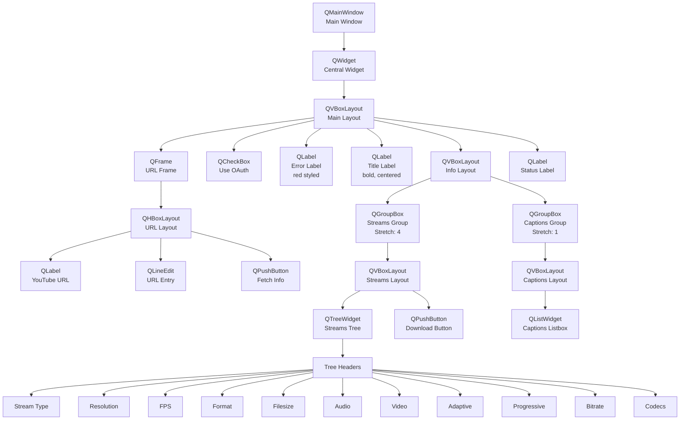

```
Main Window (QMainWindow)
└── Central Widget (QWidget)
    └── Main Layout (QVBoxLayout)
        ├── URL Frame (QFrame)
        │   └── URL Layout (QHBoxLayout)
        │       ├── URL Label (QLabel "YouTube URL:")
        │       ├── URL Entry (QLineEdit)
        │       └── Fetch Button (QPushButton "Fetch Info")
        ├── OAuth Checkbox (QCheckBox "Use OAuth...")
        ├── Error Label (QLabel - red styled)
        ├── Title Label (QLabel - bold, centered)
        ├── Info Layout (QVBoxLayout)
        │   ├── Streams Group (QGroupBox) [Stretch: 4]
        │   │   └── Streams Layout (QVBoxLayout)
        │   │       ├── Streams Tree (QTreeWidget)
        │   │       │   └── Headers:
        │   │       │       ├── "Stream Type"
        │   │       │       ├── "Resolution"
        │   │       │       ├── "FPS"
        │   │       │       ├── "Format"
        │   │       │       ├── "Filesize"
        │   │       │       ├── "Audio"
        │   │       │       ├── "Video"
        │   │       │       ├── "Adaptive"
        │   │       │       ├── "Progressive"
        │   │       │       ├── "Bitrate"
        │   │       │       └── "Codecs"
        │   │       └── Download Button (QPushButton)
        │   └── Captions Group (QGroupBox) [Stretch: 1]
        │       └── Captions Layout (QVBoxLayout)
        │           └── Captions Listbox (QListWidget)
        └── Status Label (QLabel)
```
